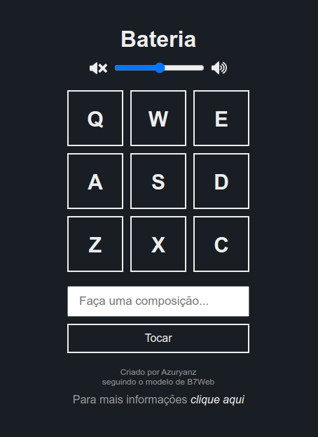

<h1 align="center">Bateria</h1>

## Sobre o Projeto
O projeto original é de autoria da B7Web, e a vídeo-aula mostrando como desenvolver o projeto base pode ser encontrada [aqui](https://alunos.b7web.com.br/curso/javascript/projeto-1-bateria).

Apesar de a vídeo-aula ter o foco voltado apra o ensino de JavaScript, por motivos de prática, todo o **HTML** e **CSS** foi desenvolvido por conta própria, apenas visualizando o layout do projeto original.

Além dos elementos desenvolvidos no projeto original, buscou-se ir um pouco mais além, adicionando os seguintes elementos:
1. Barra para controle do volume da bateria;
2. Distinção de cores para quando a bateria estiver com o som habilitado e mutado (volume zero);
3. Um painel lateral com uma versão resumida das informações encontradas aqui.

## Como utilizar


### Pré-requisitos

É necessário que ambos [Node.js](https://nodejs.org/en/) e [MySQL](https://www.mysql.com/) estejam instalados em sua máquina.

Após a instalação, faça o download do repositório.

### Configuração do banco de dados

Primeiramente, é necessário configurar as credenciais de usuário e senha do banco de dados. Para isso, abra o arquivo config.json dentro da pasta backend, alterando usuário e senha conforme necessário.

```bash
  {
    "user": "<usuário>",
    "password": "<senha>"
  }
```
Caso não esteja utilizando MariaDB, execute o comando a seguir no terminal MySQL:

```sh
  ALTER USER '<usuário>'@'localhost' IDENTIFIED WITH mysql_native_password BY '<senha>'
```

### Instalando as Dependências

No terminal, navegue até a pasta raiz do projeto e execute o seguinte comando:

```sh
npm install
```
### Rodando o servidor


Ao finalizar a instalação das dependências, inicie seu servidor MySQL, e em seguida execute o comando abaixo:

```sh
npm start
```

Assim que for executado, uma página no navegador será aberta no localhost:3333, com o título **Test To Speech - IBM Watson**.

### Utilizando a aplicação

Insira um texto na caixa a esquerda e clique no botão **Cadastrar**. 
A página será recarregada em uma caixa aparecerá na direita, contendo o texto escrito e um botão **Ouvir**
Pressione o botão **Ouvir** para reproduzir o áudio.